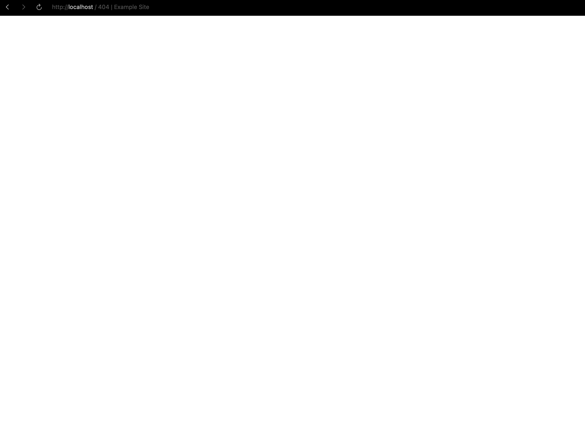
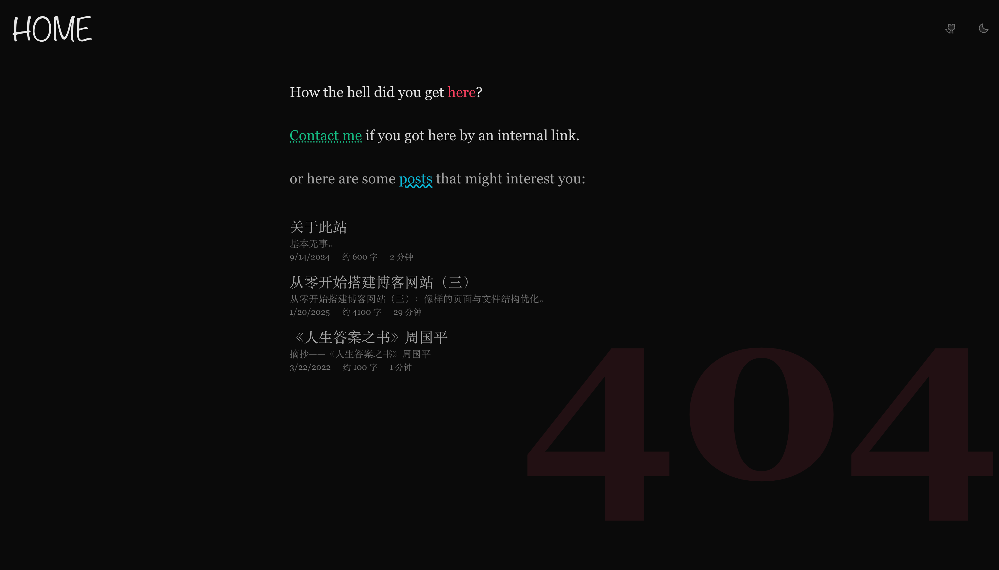
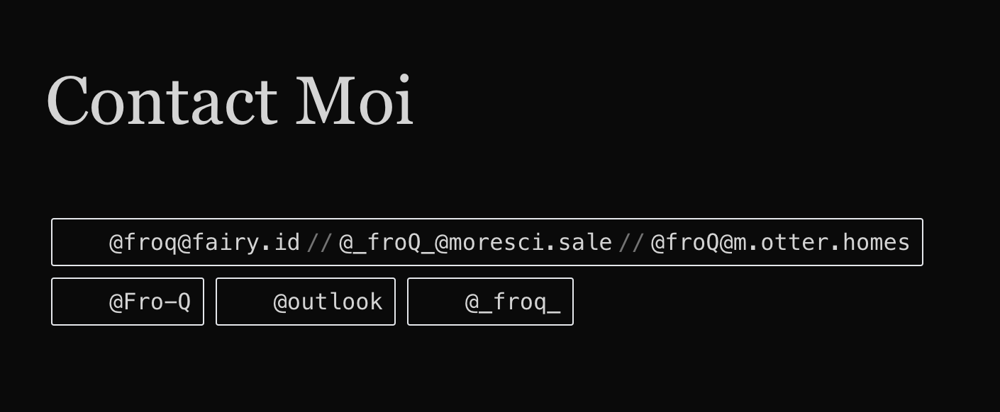
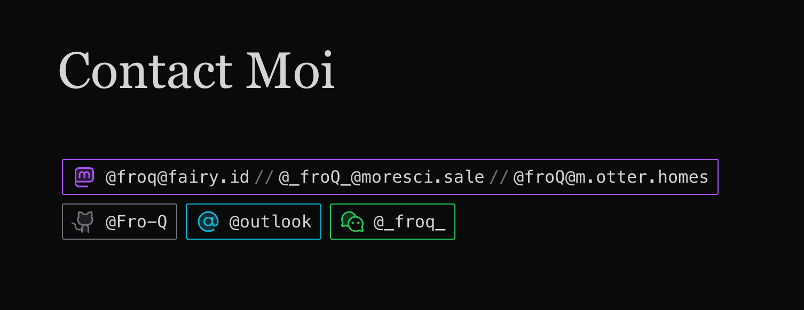

从零开始搭建博客网站（十）：404 找不见和 Contact。

---

[[toc]]

## 404 找不见

当访问站点中未被定义的路由时，会返回一个 404 页面。
在开发服务器中随便访问一个不存在的路由，
如 `http://localhost:5173/ok`，
看看长啥样：



可以看到，尽管处于黑暗模式下，
这个页面仍然是白色的。
在开发者工具中可以看到，`#app` 这个元素中没有任何内容，
高度为 0。
这意味着在 `Layout.vue` 中没有任何内容被渲染出来。

VitePress 提供的 `useData()` 函数中提供了一个 `page` 对象,
其中有一个属性 `isNotFound`，
可以用于判断当前页面是否是 404。
我们可以基于这个属性来做一个简单的组件：

```vue [./docs/.vitepress/theme/components/PageContentNotFound.vue]
<script setup lang="ts">
import type { Data } from '../src/posts.data'
import { data as posts } from '../src/posts.data'

const randomPosts = posts.sort(() => Math.random() - 0.5).slice(0, 3)

function metaStrings(post: Data) {
  return [
    post.created.formattedString,
    `约 ${post.readingInfo.words} 字`,
    `${post.readingInfo.minutes} 分钟`,
  ]
}
</script>

<template>
  <h1
    un-text="align-right 400px rose-500/10"
    un-font="serif 900"
    un-absolute
    un-right-0
    un-bottom-0
    un-select-none
    un-z-0
  >
    404
  </h1>
  <un-page-content
    un-relative
    un-z-1
  >
    <p
      un-text="2xl neutral-800 dark:neutral-200"
      un-font="serif"
      un-my-10
    >
      How the hell did you get <span
        un-text-rose-500
      >here</span>?
    </p>
    <p
      un-text="2xl neutral-700 dark:neutral-300"
      un-font="serif"
      un-mb-10
    >
      <a
        href="/contact/"
        un-text-emerald-500
        un-underline="~ dotted"
        un-hover="rotate-3 scale-105"
        un-duration-200
        un-inline-block
      >Contact me</a> if you got here by an internal link.
    </p>
    <p
      un-text="2xl neutral-600 dark:neutral-400"
      un-font="serif"
      un-mb-10
    >
      or here are some <a
        href="/#%E5%85%A8"
        un-text-cyan-500
        un-underline="~ wavy"
        un-hover="-rotate-3 scale-115"
        un-duration-200
        un-inline-block
      >posts</a> that might interest you:
    </p>
    <div
      v-for="post in randomPosts"
      :key="post.url"
      un-font-serif
      un-py-2
    >
      <a
        un-text-2xl
        un-text="neutral-600 dark:neutral-400 hover:neutral-900 dark:hover:neutral-100"
        un-transition-colors
        un-duration-200
        :href="post.url"
      >{{ post.frontmatter.title }}</a>
      <p
        un-text-neutral-500
        v-html="post.excerpt"
      />
      <div
        un-text-neutral-500
        un-flex
        un-gap-5
        un-text-sm
      >
        <div
          v-for="metaString in metaStrings(post)"
          :key="metaString"
        >
          {{ metaString }}
        </div>
      </div>
    </div>
  </un-page-content>
</template>
```

然后记得在 `PageContent.vue` 中使用它：

```vue {2,4,7,12}
<script setup lang="ts">
import { useData } from 'vitepress'
import PageContentHome from './PageContentHome.vue'
import PageContentNotFound from './PageContentNotFound.vue'
import PageContentPost from './PageContentPost.vue'

const { page, frontmatter } = useData()
</script>

<template>
  <PageContentHome v-if="frontmatter.home" />
  <PageContentNotFound v-else-if="page.isNotFound" />
  <PageContentPost v-else />
</template>
```

简简单单一个组件，就能让你的网站在 404 时有个好看的页面出来。
长成这样：



## Contact Moi

上面的 `PageContentNotFound.vue` 组件中有一个通往 `/contact/` 的路由，
所以现在来做一下这个页面。

一种思路是像 404 一样，
在 `PageContent.vue` 中做条件渲染。
VitePress 提供的
[`useRoute`](https://vitepress.dev/reference/runtime-api#useroute)
函数中的 `path` 属性即为当前页面的路径。

```vue {2,3,8,13}
<script setup lang="ts">
import { useData, useRoute } from 'vitepress'
import PageContentContact from './PageContentContact.vue'
import PageContentHome from './PageContentHome.vue'
// ...

const { page, frontmatter } = useData()
const { path } = useRoute()
</script>

<template>
  <PageContentHome v-if="frontmatter.home" />
  <PageContentContact v-else-if="path === '/contact/'" />
  <!-- ... -->
</template>
```

当然，需要有 `PageContentContact.vue` 这个文件。
看我小操作：

```vue
<script setup lang="ts">
interface Contact {
  title: string
  iconUno: string
  links: {
    link: string
    text: string
  }[]
  colorUno: string
}

const contacts: Contact[] = [
  {
    title: 'Mastodon',
    iconUno: 'i-ph-mastodon-logo-duotone',
    links: [
      { link: 'https://fairy.id/@froq', text: '@froq@fairy.id' },
      { link: 'https://moresci.sale/@_froQ_', text: '@_froQ_@moresci.sale' },
      { link: 'https://m.otter.homes/@froQ', text: '@froQ@m.otter.homes' },

    ],
    colorUno: 'purple',
  },
  {
    title: 'GitHub',
    iconUno: 'i-ph-github-logo-duotone',
    links: [{
      link: 'https://github.com/Fro-Q',
      text: '@Fro-Q',
    }],
    colorUno: 'zinc',
  },
  {
    title: 'Email',
    iconUno: 'i-ph-at-duotone',
    links: [
      { link: 'mailto:froqqq@outlook.com', text: '@outlook' },
    ],
    colorUno: 'cyan',
  },
  {
    title: 'WeChat',
    iconUno: 'i-ph-wechat-logo-duotone',
    links: [
      { link: '', text: '@_froq_' },
    ],
    colorUno: 'green',
  },
]
</script>

<template>
  <un-page-content>
    <div
      un-my-10
      un-text="5xl/relaxed"
      un-font-serif
      un-max-w-full
    >
      Contact Moi
    </div>
    <div
      v-for="contact in contacts"
      :key="contact.title"
      un-inline-block
      un-font-mono
    >
      <div
        un-flex="~ row wrap"
        un-items-center
        un-justify-start
        un-p="x-2 y-1"
        un-m-1
        un-rounded-sm
        un-transition-colors
        un-duration-200
        un-border
        :class="`border-${contact.colorUno}-500`"
        :title="contact.title"
      >
        <div
          :class="`${contact.iconUno} text-${contact.colorUno}-500`"
          un-w-6
          un-h-6
          un-mr-2
        />
        <div
          v-for="link in contact.links"
          :key="link.link"
        >
          <a
            :href="link.link ? link.link : undefined"
            target="_blank"
            rel="noopener noreferrer"
          >
            <code
              :class="`hover:text-${contact.colorUno}-500`"
            >
              {{ link.text }}
            </code>
          </a>
          <span
            v-if="link !== contact.links[contact.links.length - 1]"
            un-text="neutral-500"
            un-mx-1
          >//
          </span>
        </div>
      </div>
    </div>
  </un-page-content>
</template>
```

这里我配置了自己的四项联系方式，
并为每一项配置了一个相应的高亮的颜色和图标。

当然，
不出意外的话就要出意外了。 看看我们的页面， 边框颜色、文本颜色和图标都没有渲染：



实际上，这是 UnoCSS 的预期行为。
由于 UnoCSS 在 build time 工作，
意味着它在 compile time 不会「知道」可能被动态生成的类名。
不过问题不大，
UnoCSS 提供一个 `safelist` 配置项来解决这个问题。
我们可以枚举我们已知的、会出现的、动态生成的类名，
以确保 UnoCSS 一定会为这些类名生成相应的样式。

所以，现在的问题就变成了：我们如何在 `uno.config.mts` 中获取到这些类名？

我们已经在 `PageContentContact.vue` 中配置了所有的联系方式信息，
其中就包括 `iconUno` 和 `colorUno`。
但要想在 `uno.config.mts` 中获取到这些信息，
我们需要将其从 `PageContentContact.vue` 中提取出来。

新建一个 `contacts.json` 文件，
在其中记录必要的信息：

```json
[
  {
    "title": "Mastodon",
    "iconUno": "i-ph-mastodon-logo-duotone",
    "links": [
      { "link": "https://fairy.id/@froq", "text": "@froq@fairy.id" },
      { "link": "https://moresci.sale/@_froQ_", "text": "@_froQ_@moresci.sale" },
      { "link": "https://m.otter.homes/@froQ", "text": "@froQ@m.otter.homes" }

    ],
    "colorUno": "purple"
  },
  {
    "title": "GitHub",
    "iconUno": "i-ph-github-logo-duotone",
    "links": [{
      "link": "https://github.com/Fro-Q",
      "text": "@Fro-Q"
    }],
    "colorUno": "zinc"
  },
  {
    "title": "Email",
    "iconUno": "i-ph-at-duotone",
    "links": [
      { "link": "mailto:froqqq@outlook.com", "text": "@outlook" }
    ],
    "colorUno": "cyan"
  },
  {
    "title": "WeChat",
    "iconUno": "i-ph-wechat-logo-duotone",
    "links": [
      { "link": "", "text": "@_froq_" }
    ],
    "colorUno": "green"
  }
]
```

然后在 `uno.config.mts` 中引入这个文件，
得到 `contacts` 变量，
随后做出一个 `safelist`：

```ts {6,8,9,12-17}
import {
  defineConfig,
  // ...
} from 'unocss'

import contacts from './docs/.vitepress/theme/src/contacts.json'

const safeIcons = contacts.map(c => c.iconUno)
const safeColors = contacts.map(c => c.colorUno)

export default defineConfig({
  safelist: [
    ...safeIcons,
    ...safeColors.map(c => `border-${c}-500`),
    ...safeColors.map(c => `text-${c}-500`),
    ...safeColors.map(c => `hover:text-${c}-500`),
  ],
  // ...
})
```

记得把 `PageContentContact.vue` 里的 `contacts` 也换掉：

```vue {2}
<script setup lang="ts">
import contacts from '../src/contacts.json'
</script>

<!-- ... -->
```

收工！


