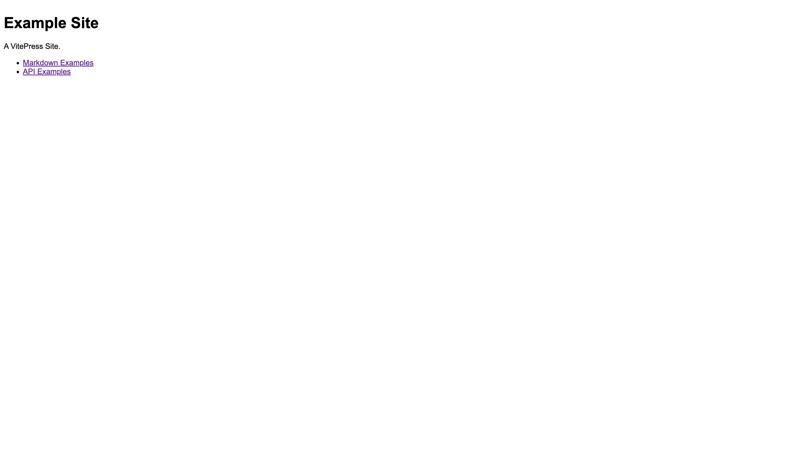
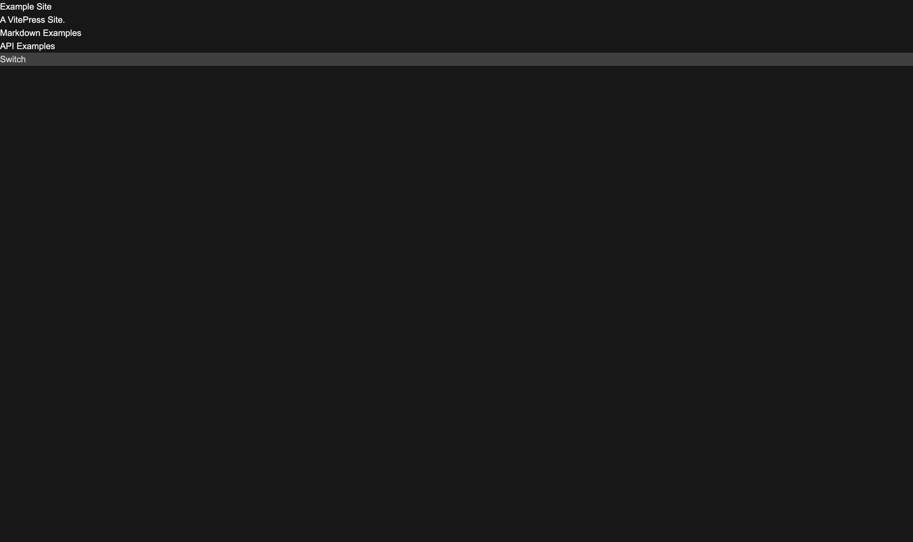

从零开始搭建博客网站（二）：开发环境、`.gitignore` 与黑暗模式。

---

[[toc]]

## 开发环境

注意到初始化后， `./package.json` 中存在以下脚本：

```json
{
  "scripts": {
    "docs:dev": "vitepress dev docs",
    "docs:build": "vitepress build docs",
    "docs:preview": "vitepress preview docs"
  }
  // ...
}
```

即：
我们可以通过 `pnpm run docs:dev` 启动开发服务器，
通过 `pnpm run docs:build` 构建静态文件，
通过 `pnpm run docs:preview` 预览构建后的静态文件。
开发环境服务器默认运行在 `http://localhost:5173/`。
预览静态文件的服务器运行在 `http://localhost:4173/`。

运行 `pnpm run docs:dev` 后，
注意到多出了 `./docs/.vitepress/cache/` 文件夹。
这是用于存储开发服务器缓存的文件夹。

运行 `pnpm run docs:build` 后，
注意到多出了 `./docs/.vitepress/dist/` 文件夹，
这是用于存储生产环境构建文件的文件夹。

注意，
如果您的系统或浏览器处于黑暗模式，
下面这张图可能会亮瞎您的眼睛。
（虽然这个提醒可能有点晚了，ごめん :face_holding_back_tears: ）



## `.gitignore`

由上面的介绍可知，
部分文件夹是不需要提交到仓库的，
如 `./docs/.vitepress/cache/`。
可以通过配置 `.gitignore` 文件来忽略这些文件夹：

```txt
node_modules/
docs/.vitepress/cache/
```

需要说明的是，
如果使用 GitHub Actions 等 CI/CD 工具，
则应将 `./docs/.vitepress/dist/` 文件夹加入 `.gitignore` 文件，
因为 GitHub Actions 会自动构建静态文件，
这也是较为常规的做法。
如果不使用这类工具，
则理论上（因为我没实践过）你只能在本地手动完成构建后再推送到仓库，
这种情况下不要将 `./docs/.vitepress/dist/` 文件夹忽略。

现在，我们可以将 `.gitignore` 文件提交到仓库。

## 黑暗模式｜Dark Mode

### 添加黑暗模式样式

在 [文档](https://vitepress.dev/reference/site-config#appearance)
中我们可以看到 VitePress 支持黑暗模式。
可以通过更改设备的用户偏好模式（A.K.A. 深色模式、夜间模式、睡觉模式 etc.）来查看效果。
但是你会发现没有效果 :smile: ，
因为我们使用的是自定义主题，
并没有针对黑暗模式设计样式。

看一下 `Layout.vue` 的 DOM 结构：

```vue
<script setup lang="ts">
import { useData } from 'vitepress'

// https://vitepress.dev/reference/runtime-api#usedata
const { site, frontmatter } = useData()
</script>

<template>
  <div v-if="frontmatter.home">
    <h1>{{ site.title }}</h1>
    <p>{{ site.description }}</p>
    <ul>
      <li><a href="/markdown-examples.html">Markdown Examples</a></li>
      <li><a href="/api-examples.html">API Examples</a></li>
    </ul>
  </div>
  <div v-else>
    <a href="/">Home</a>
    <Content />
  </div>
</template>
```

可以看到，默认的 DOM 结构中并没有将整个页面包裹在一个 `<div>` 中，
也就意味着我们无法直接在 `Layout.vue` 中为整个页面添加样式。
我们可以在 `Layout.vue` 中添加一个 `<div>`，将整个页面包裹在其中，
然后使用 UnoCSS 为这个 `<div>` 添加样式，
也可以在 `style.css` 中直接操作 `<body>` 元素。
这里我们选择第一种方案。

```html {3-8,10}
<!-- ... -->

<template>
  <div un-min-h-100vh un-bg="neutral-50 dark:neutral-950" un-text="neutral-700 dark:neutral-300">
    <!-- ... -->
  </div>
</template>
```

现在，可以通过更改设备的用户偏好模式来查看效果。



### 手动切换黑暗模式

`presetMini` 预设中存在
一个 [`dark` 配置项](https://unocss.dev/presets/mini#dark)，
用于控制 `dark:` 变体组的应用条件。
其默认值为 `class`，即通过 `.dark` 选择器来实现控制。

我们可以自己写函数来向 `<html>` 元素添加 `dark` 类名，从而手动切换黑暗模式。
同时 VitePress 的站点配置中有一项 `appearance`，
可以根据用户偏好模式来向 `<html>` 元素添加 `dark` 类名。
这个配置项默认为 `true`。
打开浏览器的开发者工具，
可以看到当用户偏好模式设置为深色时，
`<html>` 元素会添加 `dark` 类名。
这样一来，我们可以在尊重用户偏好模式的同时，进行手动切换。

具体怎么实现，接着看看。

#### 其中一种实现方式

在 `Layout.vue` 中添加一个「按钮」
（任意位置都可以，反正以后要改 :joy: ），
并监听 `click` 事件，
切换 `<html>` 元素的 `dark` 类名：

```vue {7-10,21-26}
<script setup lang="ts">
import { useData } from 'vitepress'

// https://vitepress.dev/reference/runtime-api#usedata
const { site, frontmatter } = useData()

function switchDarkMode(): void {
  const htmlEl: HTMLElement | null = document.querySelector('html')
  htmlEl?.classList.toggle('dark')
}
</script>

<template>
  <div
    un-min-h-100vh
    un-bg="neutral-50 dark:neutral-950"
    un-text="neutral-700 dark:neutral-300"
  >
    <!-- ... -->

    <div
      un-bg="neutral-300 dark:neutral-700"
      un-text="neutral-700 dark:neutral-300"
      class="dark-mode-switcher"
      @click="switchDarkMode"
    >
      Switch
    </div>
  </div>
</template>
```

完毕。
