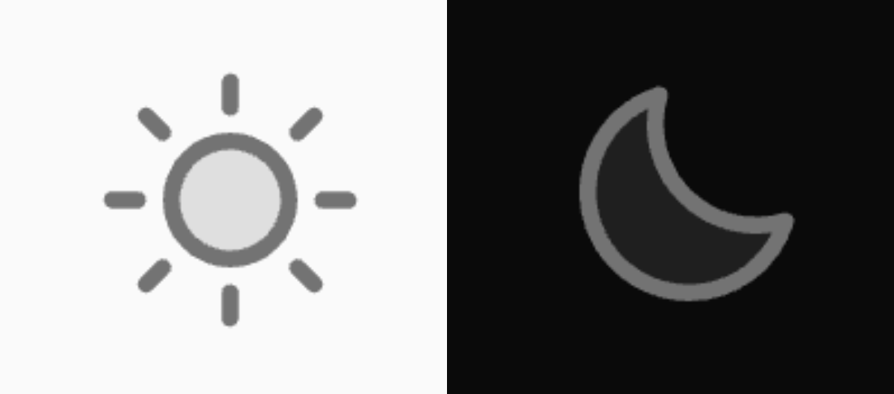

从零开始搭建博客网站（四）：更好的黑暗模式。

---

[[toc]]

#log/dev #roadmap/blog_site

## 更好的黑暗模式

### 怎么个事

在 [这个系列的第二篇文章](build_a_blog_site_2.md) 中，
我们已经实现了尊重用户偏好模式的同时，
支持手动切换的黑暗模式功能。
进行手动切换的按钮是一个很简单的按钮，
没有什么特殊的样式。
一般情况下，
我们可能会希望这个按钮在黑暗模式开启或关闭时是不同的样式，
比如一个太阳和一个月亮。

### 复习

看一下，现在我们的 `PageNav.vue` 文件中有以下内容：

::: code-group

```vue [./docs/.vitepress/theme/components/PageNav.vue]
<script setup lang="ts">
function switchDarkMode(): void {
  const htmlEl: HTMLElement | null = document.querySelector('html')
  htmlEl?.classList.toggle('dark')
}
</script>

<template>
  <nav
    un-flex="~ row"
    un-justify-between
    un-p-4
  >
    <a
      un-text-blue-500
      un-hover="underline"
      href="/"
    >Home</a>
    <div
      un-bg="neutral-300 dark:neutral-700"
      un-text="neutral-700 dark:neutral-300"
      class="dark-mode-switcher"
      @click="switchDarkMode"
    >
      Switch
    </div>
  </nav>
</template>
```

:::

可以看到，
我们使用一个 `switchDarkMode()` 函数来切换黑暗模式。
它做的工作很简单——在 `<html>` 元素上切换 `dark` 类。

### 响应式状态

要实现在黑暗模式下不同按钮状态，
我们需要一个响应式状态：

```vue twoslash
<script setup lang="ts">
// @errors: 18047
import { onMounted, ref, triggerRef } from 'vue'

const htmlEl: HTMLElement | null = document.querySelector('html')
//    ^?

const darkMode = ref({
  get state(): boolean {
    return htmlEl.classList.contains('dark')
  },

  set state(value: boolean) {
    toggleDarkClass(value)
  },
})

function toggleDarkClass(value: boolean) {
  if (value) {
    htmlEl.classList.add('dark')
  }
  else {
    htmlEl.classList.remove('dark')
  }
}
</script>

<!-- ... -->
```

我们在 `setup` 中定义了一个 `darkMode` 变量，
包含名为 `state` 的 `getter` 和 `setter`，
用于获取和设置黑暗模式的状态；
同时定义有 `toggleDarkClass()` 函数来进行实际的 DOM 操作，
即在 `<html>` 元素上切换 `dark` 类。

如果您使用 JS，
可以直接跳过至 [模板中的处理](build_a_blog_site_4#模板中的处理)。

从这里开始，
我们会对 TypeScript 有更深入的了解。
可以看到，
上面的代码抛出了错误：`'htmlEl' is possibly 'null'.`，
这是因为 `document.querySelector("html")` 可能返回 `null`。
我们有多种方式可以解决这个问题。

#### 类型断言｜Type Assertion

有些时候，
TypeScript 得出的类型并非我们所期望的。
在上面这个例子中，
`document.querySelector("html")` 返回的类型是 `Element | null`，
而我们希望 `htmlEl` 的类型一定是 `HTMLElement`。
我们可以使用类型断言来解决这个问题：

```vue twoslash {5}
<script setup lang="ts">
// ...

// [!code word:as HTMLElement]
const htmlEl = document.querySelector('html') as HTMLElement
//    ^?
// 也可以使用下面的形式，等价：
// const htmlEl = <HTMLElement>document.querySelector("html");

// ...
</script>

<!-- ... -->
```

我们断言 `htmlEl` 一定是 `HTMLElement`，
这样就可以避免报错。
需要注意的是，
类型断言并不会改变 `htmlEl` 实际的类型，
它只是告诉 TypeScript 我们确定 `htmlEl` 一定是 `HTMLElement`，
但我们的确定不一定是对的 :sweat_smile: ，
所以使用类型断言时要谨慎。

#### 非空断言｜Non-null Assertion

在这个特殊的例子中，
因为我们需要「去除」的另一个类型是 `null`。
我们可以使用非空断言来解决这个问题：

```vue twoslash {5}
<script setup lang="ts">
// ...

// [!code word:!:1]
const htmlEl = document.querySelector('html')!
//    ^?

// ...
</script>

<!-- ... -->
```

和上一个方法类似，
我们断言 `htmlEl` 一定非空。
需要注意的是——同样地——这并不会改变 `htmlEl` 实际的类型。

#### 可选链｜Optional Chaining

可选链用于处理可能为 `null` 或 `undefined` 的值。
在 TypeScript 以及 JavaScript 中，
对于 `a.b` 这样的调用，
如果 `a` 为 `null` 或 `undefined`，
则会抛出错误 `Cannot read properties of null (reading 'b')`
或 `Cannot read properties of undefined (reading 'b')`。
使用形如 `a?.b` 的可选链可以避免这种情况，
在 `a` 为 `null` 或 `undefined` 时直接返回 `undefined`：

```vue twoslash
<script setup lang="ts">
// @errors: 2322
import { onMounted, ref, triggerRef } from 'vue'

const htmlEl: HTMLElement | null = document.querySelector('html')
// [!code word:?]
const darkMode = ref({
  get state(): boolean {
    return htmlEl?.classList.contains('dark')
  },

  set state(value: boolean) {
    toggleDarkClass(value)
  },
})

function toggleDarkClass(value: boolean) {
  if (value) {
    htmlEl?.classList.add('dark')
  }
  else {
    htmlEl?.classList.remove('dark')
  }
}
</script>

<!-- ... -->
```

所以如你所见，
使用可选链会导致另一个问题：
`darkMode` 的 `getter` 函数的返回值类型实际上是 `boolean | undefined`，
但我们希望它是 `boolean`，
虽然可以加入新的验证逻辑去解决，
但无疑会增加代码的复杂度。

### 模板中的处理

有了 `darkMode` 这个状态和 `toggleDarkClass()` 函数，
我们就可以在模板中实现下面的操作：
（顺便设计一下排版和样式）

```vue {7,14,15,40}
<script setup lang="ts">
// ...
</script>

<template>
  <nav
    un-flex="~ row"
    un-justify-between
    un-p-4
  >
    <un-m-2>
      <a
        un-text="5xl neutral-800 dark:neutral-200"
        un-font="[noteworthy]"
        href="/"
      >HOME</a>
    </un-m-2>
    <div
      un-flex="~ row"
      un-items-center
      un-gap-6
      un-text-xl
    >
      <a
        un-m-1
        un-h-6
        un-w-6
        un-flex
        un-items-center
        un-justify-center
        un-text="neutral-500 hover:neutral-700 dark:hover:neutral-300"
        un-transition-colors
        un-duration-200
        href="https://github.com/"
      >
        <un-i-ph-github-logo-duotone />
      </a>
      <div
        un-m-1
        un-h-6
        un-flex
        un-cursor-pointer
        un-items-center
        un-justify-center
        un-text="neutral-500 hover:neutral-700 dark:hover:neutral-300"
        un-transition-colors
        un-duration-200
        @click="darkMode.state = htmlEl.classList.contains('dark') ? false : true"
      >
        <un-i-ph-moon-duotone v-if="darkMode.state" />
        <un-i-ph-sun-duotone v-else />
      </div>
    </div>
  </nav>
</template>
```

先讲一下结构变化。
之前我们直接把 `<a>` 和切换黑暗模式的按钮放在 `<nav>` 下，
当只有两个子元素时是能使其分布在两端的，
但是若子元素数量大于两个，
则元素会从左到右依次排列。
所以我们把 `<nav>` 分为两个部分，
作为导航栏左侧和右侧的区域，
实现两端对齐的效果。

在导航栏右侧区域中，
加入了一个跳转至 GitHub 仓库的按钮，
读者可以（应该）将 `href` 属性修改为自己的仓库地址。
随后，我们实现了切换黑暗模式的按钮，
并监听按钮的点击事件来切换 `darkMode` 的状态。
我们在 icon 上使用 `v-if / v-else` 指令，
根据 `darkMode` 的状态来决定显示哪个图标。

现在我们的按钮在黑暗模式下将显示为一个月亮，
在非黑暗模式下则将显示为一个太阳。



细心的人可能会发现，
如果此时切换用户偏好模式，
也就是系统的深色 / 浅色模式，
确实会切换网站的黑暗模式，
但是按钮的图标并不会随之改变。
这是因为我们并没有监听系统的模式变化，
所以我们需要在 `onMounted` 钩子中监听 `matchMedia` 的变化，
并在变化时触发响应式状态更新：

```vue {4-8}
<script setup lang="ts">
// ...

onMounted(() => {
  window.matchMedia('(prefers-color-scheme: dark)').addEventListener('change', () => {
    triggerRef(darkMode)
  })
})
</script>

<!-- ... -->
```

搞定。
