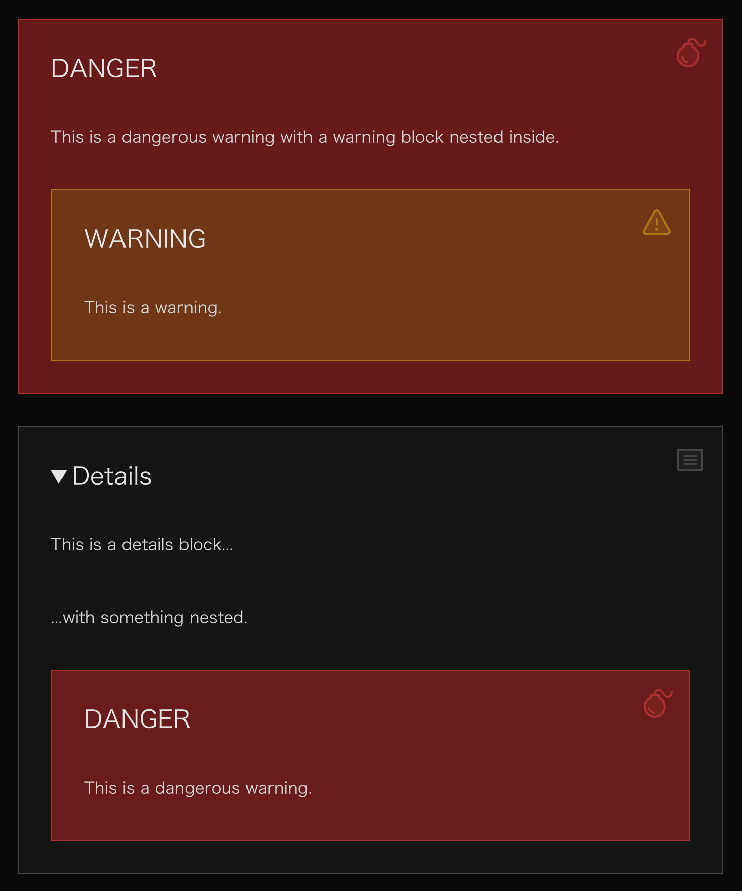

从零开始搭建博客网站（六）：文章 Markdown 样式。

---

[[toc]]

## 文章 Markdown 样式

### 简单认识 Markdown

简单来讲，
Markdown 是一种标记语言，
让我们可以用一些直观的符号来标记不同的文字格式，
如使用不同数量的 `#` 标记标题、
使用 `---` 标记一个分隔线等等。
由于 John Gruber 等人在「创造」 Markdown 时，
并没有制定具体的语法规范，
使得 Markdown 在其发展中出现了多种不同的风格。
为了在消除语法上的歧义和不一致，
[CommonMark](https://commonmark.org/) 项目应运而生。
而 GitHub 在 CommonMark 的基础上，
制定了 [GitHub Flavored Markdown（GFM）](https://github.github.com/gfm/)，
以适应其社区的需求。
GFM 是 CommonMark 的严格超集。
以上二者是目前最常见的 Markdown 规范。

也就是说，
由于使用的规范不同，
加之软件自身的设计差异，
一些「小众」的语法可能并不会被所有编辑器和解析器支持。
无论如何，
这不太影响我们为绝大多数语法设计样式。

VitePress 使用
[markdown-it](https://github.com/markdown-it/markdown-it)
来解析 Markdown 语法。

### 先看看

在开发服务器中进入 VitePress 为我们生成的 Markdown Examples 文章，
看看在使用自定义主题的情况下它有多不可读：


可以看到什么也看不到。

### DOM

看看 `PageContentPost.vue` 中的结构：

```vue [./docs/.vitepress/theme/components/PageContentPost.vue]
<script setup lang="ts"></script>

<template>
  <Content
    un-max-auto
    un-max-w="[700px]"
    id="content"
  />
</template>
```

### 改一点结构

可以看到，
这里的页面内容只包括 Mardown 文件的内容，
没有标题。
所以稍微改一下 `PageContentPost.vue`：

```vue {2,4,8-15}
<script setup lang="ts">
import { useData } from 'vitepress'

const { frontmatter } = useData()
</script>

<template>
  <un-page-content>
    <div
      un-my-10
      un-text="5xl/relaxed"
      un-font-serif
      un-max-w-full
    >
      {{ frontmatter.title }}
    </div>
    <Content
      id="content"
    />
  </un-page-content>
</template>
```

下面来逐步完成 Markdown 中常见元素的渲染。

### 最基本的东西

首先是字体、行距等等的基本样式：

```css
html {
  font-family: 'Hiragino Sans GB', 'Microsoft YaHei', 'Helvetica Neue', Helvetica, Arial, sans-serif;
  /* smooth */
  --uno: 'antialiased';
}

#content {
  --uno: 'text-base/10';
  --uno: 'py-10';

  & p {
    --uno: 'my-8';
  }
}
```

### 标题

对于 1 - 6 级标题，
设置不同的字体大小；
使用 `::before` 伪元素在标题前添加层级标识：

```css
#content {
  /* ... */
  & :is(h1, h2, h3, h4, h5, h6) {
    --uno: 'my-10 px-4 w-fit relative block font-normal';
    --uno: 'text-neutral-800 dark:text-neutral-200';
    --uno: 'before:(absolute -translate-x-[150%] text-[0.8em] opacity-40)';
  }

  & h1 {
    --uno: 'text-4xl/10 before:content-["#1"]';
  }
  & h2 {
    --uno: 'text-3xl/10 before:content-["#2"]';
  }
  & h3 {
    --uno: 'text-2xl/10 before:content-["#3"]';
  }
  & h4 {
    --uno: 'text-xl/10 before:content-["#4"]';
  }
  & h5 {
    --uno: 'text-lg/10 before:content-["#5"]';
  }
  & h6 {
    --uno: 'text-base/10 before:content-["#6"]';
  }
}
```

看看效果：


### 行内元素

下面是常见的行内元素，
包括 **strong**、
*em*、
[link](/)、
`inline code`、
~~strikethrough~~、
<u>underline</u>：

```css
#content{
  /* ... */

  /* strong */
  & strong {
    --uno: 'font-black';
    --uno: 'text-neutral-950 dark:text-neutral-50';
  }

  & a {
    --uno: 'relative inline-block text-nowrap';
    --uno: 'text-neutral-900 dark:text-neutral-100';
    --uno: 'before:(content-[""] absolute bottom-0.5em w-full h-px bg-neutral-500)';
    --uno: 'before:(transition duration-200) after:(transition duration-200)';
    /* link icon */
    --uno: 'after:(content-[""] i-ph-link-duotone inline-block align-middle ml-1 text-neutral-500)';
    --uno: 'hover:(before:(bg-neutral-950 dark:bg-neutral-50) after:(text-neutral-950 dark:text-neutral-50))';
  }

  /* underline */
  & u {
    --uno: 'decoration-(wavy 1)';
    --uno: 'underline-offset-4';
  }

  /* inline code */
  & :not(pre) > code {
    --uno: 'mx-1';
    --uno: 'bg-neutral-200/50 dark:bg-neutral-800/50';
    --uno: 'text-neutral-500 dark:text-neutral-500';
    --uno: 'border border-neutral-300 dark:border-neutral-700';
    --uno: 'rounded-sm';
  }

  /* strikethrough */
  & s {
    --uno: 'text-neutral-500';
  }
}
```

说两个东西。
首先，
用伪元素实现链接的下划线的原因是我给 inline code 加了两侧的 margin，
而 `decoration` 会被 margin 切断，如下图：


且我个人认为伪元素可操作性会强一点 :)

另一个要说的是，
注意到每个标题后面都有一个链接符号，
这是由于 VitePress 处理了标题锚点链接。
这玩意可以在 `config.mts` 中配置。
Type declaration 在 [这里](https://github.com/vuejs/vitepress/blob/f8feee0294db35f3d7f5416f3bd23041675d72ba/src/node/markdown/markdown.ts#L121-L125)。
这个功能由 [@valeriangalliat/markdown-it-anchor](https://github.com/valeriangalliat/markdown-it-anchor) 这个插件实现，
详细的配置方式可以访问该 repo。
这里我希望整个标题作为一个锚点链接元素，
所以我在 `config.mts` 中配置了如下内容：

```ts {1,8-12}
import anchor from 'markdown-it-anchor'
import UnoCSS from 'unocss/vite'
import { defineConfig } from 'vitepress'

// https://vitepress.dev/reference/site-config
export default defineConfig({
  // ...
  markdown: {
    anchor: {
      permalink: anchor.permalink.headerLink(),
    },
  },
})
```

当然，需要先 `pnpm install -D markdown-it-anchor`。

再当然，
我们不会希望把标题应用与链接一样的样式，
所以对链接的选择器需要再改一改。
简单来说，
标题的锚点链接一定以 `#` 开头，
可以用这个点来区分：

```css /:not(href^="#")/
#content {
  /* ... */
  
  & a:not(href^="#") {
    /* ... */
  }
}
```

### 代码块

如果是作为技术博客来讲，
代码块应该是除了正文之外使用频率最高的一种元素。
VitePress 使用 [Shiki](https://shiki.style/) 来处理代码块，
后续我们会详细讲更多关于代码块的操作。
现在先让它好看一点：

```css
#content {
  /* code block */
  & [class^='language-'] {
    --uno: 'relative my-8 w-full';
    --uno: 'text-sm';
    --uno: 'bg-neutral-100 dark:bg-neutral-900';
    --uno: 'border border-neutral-300 dark:border-neutral-700';
    --uno: 'rounded-md';

    & pre {
      --uno: 'py-6';
      --uno: 'overflow-x-auto';

      & code {
        --uno: 'px-8 block';

        & span {
          --uno: 'text-[var(--shiki-light,inherit)] dark:text-[var(--shiki-dark,inherit)]';
        }
      }
    }

    & span.lang {
      --uno: 'absolute bottom-0 right-0';
      --uno: 'px-2 py-1';
      --uno: 'text-xs';
    }

    & button.copy {
      --uno: 'absolute top-2 right-2';
      --uno: 'px-2 py-1';
      --uno: 'text-(xs neutral-500)';
      --uno: 'hover:(text-neutral-950 dark:text-neutral-50)';
      --uno: 'transition duration-200';
      --uno: 'before:(content-[""] i-ph-copy-light block w-6 h-6)';
      --uno: 'opacity-0';

      &.copied {
        --uno: 'text-emerald-500';
        --uno: 'before:(content-[""] i-ph-check-light block w-6 h-6)';

        &:hover {
          --uno: 'hover:text-emerald-500';
        }
      }
    }

    &:hover {
      & button.copy {
        --uno: 'opacity-100';
      }
    }
  }
}
```

效果如何？


### 引用与自定义容器

引用块是由 `>` 标记的元素，
而自定义容器在这里有两种类型，
一种是形如 `::: tip` 标记的 Custom Block，
另一种是形如 `> [!tip]` 标记的 GFM 风格 Alert。

```css
#content {
  & blockquote {
    --uno: 'my-8 relative px-8 py-2';
    --uno: 'bg-neutral-950/5 dark:bg-neutral-50/5';
    --uno: 'border-(l-4 neutral-500)';
    --uno: 'hover:(border-neutral-700 dark:border-neutral-300)';
    --uno: 'transition duration-200';
    --uno: 'rounded';
    --uno: 'before:(content-[""] i-ph-quotes-duotone block w-8 h-8 absolute right-4 top-4 text-neutral-500)';
  }

  & .custom-block {
    --uno: 'my-8 px-8 relative';
    --uno: 'before:content-[""]';
    --uno: 'before:(absolute right-4 top-4)';
    /* style at utilities layer to overwrite width and height set by icon below */
    --uno: 'before:(inline-block align-middle layer-utilities:w-8 layer-utilities:h-8)';
    --uno: 'before:opacity-50';

    &.note,
    &.info,
    &.details {
      --uno: 'bg-neutral-100/80 dark:bg-neutral-900/80';
      --uno: 'border-(~ neutral-500/50)';

      --uno: 'before:(text-neutral-500)';
    }

    &.warning {
      --uno: 'bg-yellow-100/80 dark:bg-yellow-900/80';
      --uno: 'border-(~ yellow-500/50)';

      --uno: 'before:(text-yellow-500)';
    }

    &.tip {
      --uno: 'bg-indigo-100/80 dark:bg-indigo-900/80';
      --uno: 'border-(~ indigo-500/50)';

      --uno: 'before:(text-indigo-500)';
    }

    &.important {
      --uno: 'bg-violet-100/80 dark:bg-violet-900/80';
      --uno: 'border-(~ violet-500/50)';

      --uno: 'before:(text-violet-500)';
    }

    &.caution,
    &.danger {
      --uno: 'bg-red-100/80 dark:bg-red-900/80';
      --uno: 'border-(~ red-500/50)';

      --uno: 'before:(text-red-500)';
    }

    /* title */
    & .custom-block-title,
    & summary {
      --uno: 'my-8';
      --uno: 'text-2xl';
      --uno: 'text-neutral-800 dark:text-neutral-200';
    }

    /* icons */
    &.note {
      /* icon at layer components to have the width and height overwritten */
      --uno: 'before:layer-components:(i-ph-notepad-duotone)';
    }

    &.info {
      --uno: 'before:layer-components:(i-ph-info-duotone)';
    }

    &.details {
      --uno: 'before:layer-components:(i-ph-article-duotone)';
    }

    &.warning {
      --uno: 'before:layer-components:(i-ph-warning-duotone)';
    }

    &.tip {
      --uno: 'before:layer-components:(i-ph-lightbulb-duotone)';
    }

    &.important {
      --uno: 'before:layer-components:(i-ph-star-duotone)';
    }

    &.caution {
      --uno: 'before:layer-compoents:(i-ph-siren-duotone)';
    }

    &.danger {
      --uno: 'before:layer-components:(i-ph-bomb-duotone)';
    }
  }
}
```

可以注意一下里面的 layer 的用法，
由于 icon 的 rule 里面自带一个宽高为 `1em` 的样式，
所以如果先定义所有 icon 的宽高，
再分别设置 icon 的话，
先定义的宽高会被覆盖掉。
一种更简单的解决方案是，
把 icon 的定义放在宽高定义之前来保证 `1em` 被覆盖掉。



### 列表项

最简单的一集，
不过注意一下无序列表的符号如何与有序列表的数字对齐。

```css
#content {
  & ol {
    list-style-type: decimal;
  }

  & ul {
    list-style-type: square;

    & li {
      --uno: '-mx-2 px-2';
    }
  }

  & ol,
  & ul {
    --uno: 'pl-8';

    & li {
      --uno: 'marker:(text-neutral-500 font-mono)';
    }
  }
}
```


### 表格

表格的可操作性还是很强的，
这里在三线表的基础上把墙线加上：

```css
#content {
  & table {
    --uno: 'my-8 w-full';
    --uno: 'border-(collapse b-2 t-2)';
    --uno: 'border-neutral-800 dark:border-neutral-200';

    & thead {
      --uno: 'border-b';

      & th {
        --uno: 'important:text-center';
      }
    }

    & tbody tr {
      --uno: 'border-b';
      --uno: 'border-neutral-300 dark:border-neutral-700';
    }

    & th,
    & td {
      --uno: 'p-(x-4 y-2)';
    }
  }
}
```

我个人喜欢把表格的标题行无脑居中，
大家自行调整。


今天到这里。
