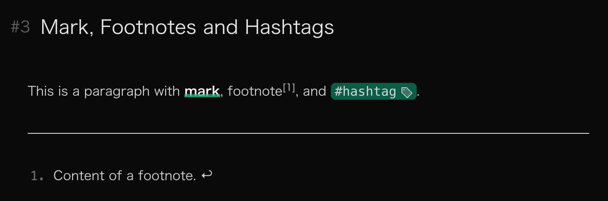

从零开始搭建博客网站（七）：Markdown 样式一些扩展。

---

[[toc]]

## 数学公式

发现了的人可能已经发现了，上期实现的效果里并没有数学公式。这是因为 `markdown-it` 本身是不解析数学公式的，需要依靠插件来实现。VitePress 内置了这个配置，不过仍需要自行安装 `markdown-it-mathjax3` 以及[配置一下 `config.mts`](https://github.com/vuejs/vitepress/blob/fb67f9c75fde865b410f919d2ac1ba1cd8dc40f1/src/node/markdown/markdown.ts#L175-L183)：

```ts
// ...

export default defineConfig({
  // ...
  markdown: {
    // ...
    math: true,  // [!code ++]
  },
})
```

然后，在 `style.css` 里设置渲染出的 `svg` 为行块：

```css
mjx-container.MathJax svg {
  --uno: 'inline-block';
}
```

bingo!

## 其他几个 Markdown 语法扩展

虽然 `markdown-it` 默认的解析应该够用了，不过确实还有可以扩展的地方。比如 `[^1]` 标记的脚注、`==` 标记的高亮，以及 `#` 标记的标签。

具体语法不细讲。先安装一下这几个插件：

```shell
pnpm install -D markdown-it-footnote markdown-it-mark markdown-it-hashtag
```

然后在 `config.mts` 中配置：

```ts
import markdownItFootnote from 'markdown-it-footnote'  // [!code ++:3]
import markdownItHashtag from 'markdown-it-hashtag'
import markdownItMark from 'markdown-it-mark'
// ...

export default defineConfig({
  // ...
  markdown: {
    // ...
    config: (md) => {  // [!code ++:6]
      md
      .use(markdownItFootnote)
      .use(markdownItMark)
      .use(markdownItHashtag)
    },
  },
})
```

然后继续写样式：

```css
#content {
  /* ... */
  /* mark */
  & mark {
    --uno: 'relative';
    --uno: 'bg-transparent';
    --uno: 'text-neutral-900 dark:text-neutral-100';
    --uno: 'font-black';
    --uno: 'before:content-[""]';
    --uno: 'before:(inline-block h-0.25em w-full absolute bottom-0)';
    --uno: 'before:(bg-emerald-500/80)';
  }

  /* hashtag */
  & a.tag {
    --uno: 'font-mono relative';
    --uno: 'px-1';
    --uno: 'text-emerald-900 dark:text-neutral-300';
    --uno: 'bg-emerald-200 dark:bg-emerald-800';
    --uno: 'rounded-md';
    --uno: 'border border-emerald-200 dark:border-emerald-800';
    --uno: 'transition duration-200';
    --uno: 'after:(content-[""] i-ph-tag-duotone inline-block align-middle ml-1)';
    --uno: 'hover:(border-emerald-900 dark:border-emerald-100)';
  }
}
```

记得再去改一下链接的选择器，把 .tag 也排除掉：

```css /.tag/
#content {
  /* ... */
  & a:not([href^='#'], .tag) {
    /* ... */
  }
}
```

长这样：




## 图片

为 Markdown 内嵌图片微调一下样式，主要是居中、边框、标题文字和放大。

实现标题文字需要用到 `markdown-it-implicit-figures` 插件。安装之后记得去 `config.mts` 中配置：

```ts [config.mts]
// ...
import markdownItFigures from 'markdown-it-implicit-figures'  // [!code ++]
// ...

export default defineConfig({
  // ...
  markdown: {
    // ...
    config: (md) => {
      md
        // ...
        .use(markdownItFigures, {  // [!code ++:3]
          figcaption: true,
        })
    },
  }
})
```

这里用 `medium-zoom` 来实现图片的点击放大。先 `pnpm` 安装一下，然后去 `Layout.vue` 中搞一下：

```vue
<script setup lang="ts">
import mediumZoom from 'medium-zoom'  // [!code ++:3]
import { useRoute } from 'vitepress'
import { nextTick, onMounted, watch } from 'vue'
// ...

const route = useRoute()  // [!code ++:18]

function initZoom() {
  mediumZoom('#content figure img', {
    margin: 24,
    background: 'var(--image-mask-bg)',
    container: document.body,
  })
}

onMounted(() => {
  initZoom()
})

watch(
  () => route.path,
  () => nextTick(() => initZoom()),
)
</script>
<template>
<!-- ... -->
</template>
```

这里的 `var(--image-mask-bg)` 在`style.css` 中定义：

```css
html {
  /* ... */

  /* background color for medium-zoom */
  --image-mask-bg: #fafafa;

  &.dark {
    --image-mask-bg: #0a0a0a;
  }

}
```

然后在 `style.css` 中配置相关的样式：

```css
#content {
  /* ... */

  /* img */
  & figure {
    --uno: 'my-8';

    & img {
      --uno: 'border border-neutral-300 dark:border-neutral-700';
    }

    & figcaption {
      --uno: 'pt-4';
      --uno: 'text-neutral-600 dark:text-neutral-400';
      --uno: 'text-sm text-center';
    }
  }
}

/* ... */

.medium-zoom-overlay {
  --uno: 'z-100';
}

img.medium-zoom-image.medium-zoom-image--opened {
  --uno: 'z-110';
}
```

完毕。
