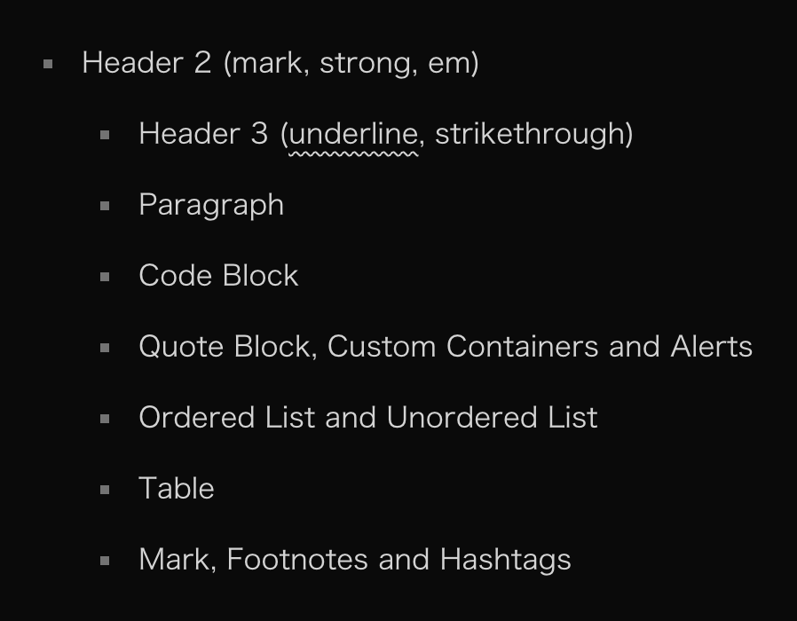
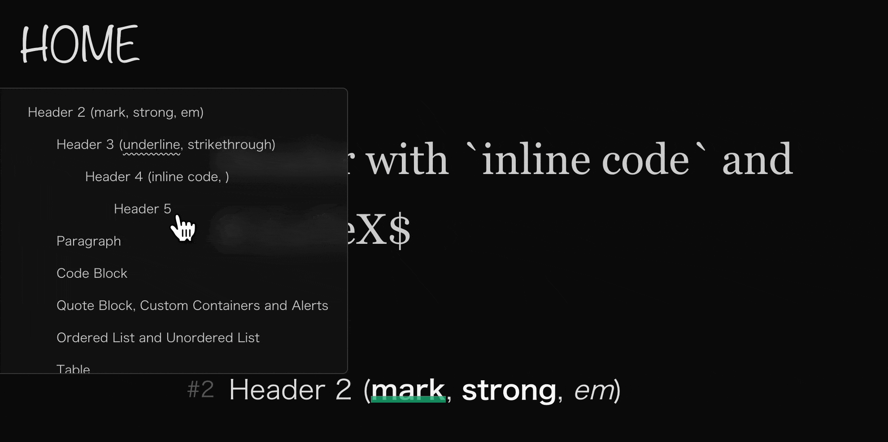
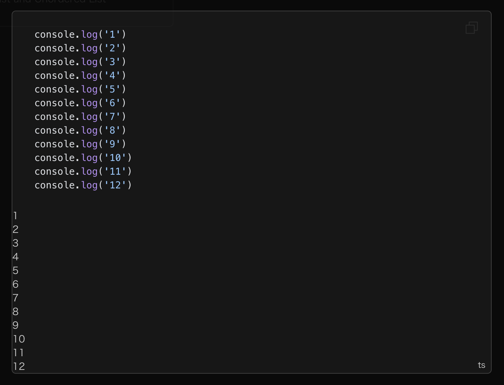
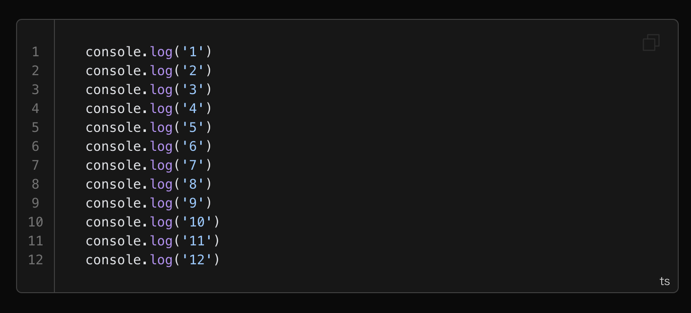
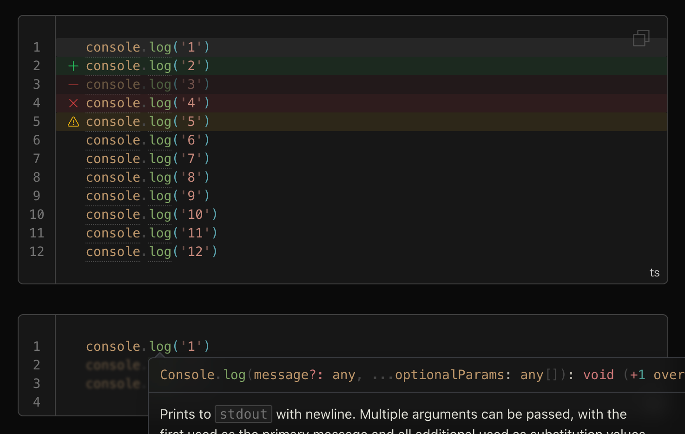
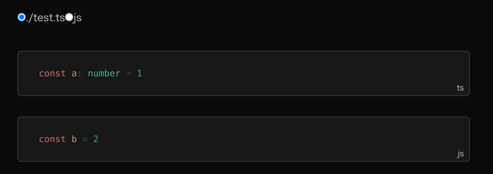
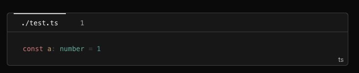

从零开始搭建博客网站（八）：文章大纲与代码块一大坨配置。

---

[[toc]]

#log/dev #roadmap/blog_site

## 文章大纲

VitePress 内置了文章大纲的功能，
可以看看 [文档这里](https://vitepress.dev/guide/markdown#table-of-contents)。
使用 `[[toc]]` 插入大纲后，
默认的样式长这样：



是的，它就是一坨列表。
我们现在来让它好看一点。

### 大纲层级

简单的配置。
在 `config.mjs` 中，
在 `markdown` 里添加 `toc` 配置项：

```ts {5-12}
export default defineConfig({
  // ...
  markdown: {
    // ...
    toc: {
      level: [
        2,
        3,
        4,
        5,
      ],
    },
  },
})
```

这里可以根据个人习惯来配置。
我在 Markdown 文件内容中不使用一级标题，
所以这里从二级标题开始。

### 样式

这里我把大纲放在了文章左侧，
使用了 `fixed` 定位。
具体的样式如下：

```css
#content {
  /* ... */
  /* toc */
  & nav.table-of-contents {
    --uno: 'rounded-r-md';
    --uno: 'pr-5';
    --uno: 'fixed top-100px left-0 z-10';
    --uno: 'max-h-320px min-w-200px max-w-400px';
    --uno: 'overflow-auto';
    --uno: 'text-sm';

    --uno: 'bg-neutral-100/60 dark:bg-neutral-900/60';
    --uno: 'border border-neutral-300 dark:border-neutral-700';
    --uno: 'opacity-10 hover:opacity-100';
    --uno: 'transition duration-200';

    &::-webkit-scrollbar {
      --uno: 'w-1px';
    }

    &:hover {
      backdrop-filter: blur(10px);
    }

    & li {
      list-style: none;
      --uno: 'my-4 px-0 mx-0';
    }
  }
}
```

看一眼：



## 代码块指南

如果是作为技术博客来讲，
代码块应该是除了正文之外使用频率最高的一种元素
（好像在 [哪里](build_a_blog_site_6.md#代码块) 听过这句话）。
我们之前只对代码块的样式做了一些简单的配置，
这次我们需要更深入地探讨代码块的使用和样式定制。

### 行号

VitePress 提供
[代码行号的功能](https://vitepress.dev/guide/markdown#line-numbers)。
使用方式请参考文档。
在开启行号后，
代码块长成了这样：



可以看到一坨东西。
现在来做点操作：

```css
#content {
  /* ... */
  & [class^='language-'] {
    /* ... */

    /* line numbers on */
    &.line-numbers-mode {
      --uno: 'pl-10';

      & .line-numbers-wrapper {
        --uno: 'absolute bottom-0 left-0 top-0 w-10';
        --uno: 'border-r border-neutral-300 dark:border-neutral-700';
        --uno: 'pt-6';
        --uno: 'text-(center neutral-500)';
        --uno: 'font-mono';
      }
    }
  }
}
```

平平无奇的行号：



### 高亮配色

之前提到过 VitePress 使用 shiki 作为代码高亮的引擎。
我们可以在 `config.mts` 中配置 `shiki` 的主题：

```ts {5-8}
export default defineConfig({
  // ...
  markdown: {
    // ...
    theme: {
      light: 'vitesse-light',
      dark: 'vitesse-black',
    },
  },
})
```

### 代码块行标记

既然用的是 shiki，
那就意味着可以使用 shiki 的 transformer 来实现代码块的不同标记。
关于所有的 transformer，
请参考 [shiki 的文档](https://shiki.style/packages/transformers)。
VitePress 中默认开启了 `transformerNotationDiff`、
`transformerNotationFocus`、
`transformerNotationHighlight` 和 `transformerNotationErrorLevel`。
这里我们在 `config.mts` 中添加
`transformerNotationWordHighlight`、
`transformerMetaWordHighlight`、
`transformerColorizedBrackets` 和 `transformerTwoslash`：

```ts twoslash {1-4,12-19}
// @noErrors
import { transformerColorizedBrackets } from '@shikijs/colorized-brackets'
import { transformerMetaWordHighlight, transformerNotationWordHighlight } from '@shikijs/transformers'
import { transformerTwoslash } from '@shikijs/vitepress-twoslash'
import { createFileSystemTypesCache } from '@shikijs/vitepress-twoslash/cache-fs'
// ...
import { defineConfig } from 'vitepress'

export default defineConfig({
  // ...
  markdown: {
    // ...
    codeTransformers: [
      transformerTwoslash({
        typesCache: createFileSystemTypesCache(),
      }),
      transformerMetaWordHighlight(),
      transformerNotationWordHighlight(),
      transformerColorizedBrackets(),
    ],
  },
})
```

再在 `index.ts` 中引入 twoslash 的样式和客户端组件：

```ts {1-3,10}
// ...
import TwoslashFloatingVue from '@shikijs/vitepress-twoslash/client'
import '@shikijs/vitepress-twoslash/style.css'
import 'vitepress/dist/client/theme-default/styles/vars.css'
// ...

export default {
  // ...
  enhanceApp({ app }) {
    app.use(TwoslashFloatingVue)
  },
} satisfies Theme
```

现在可以使用相关的 transformer 来标记代码块了。
比如使用以下的标记：

````
```ts:line-numbers twoslash
console.log('111111111111111111111111111111111111111111111111111111111111111111111111')  // [!code highlight]
console.log('2')  // [!code ++]
console.log('3')  // [!code --]
console.log('4')  // [!code error]
console.log('5')  // [!code warning]
console.log('6')
console.log('7')
console.log('8')
console.log('9')
console.log('10')
console.log('11')
console.log('12')
```
````

然后你就会发现什么也没发现。
何故呢？
当然是因为样式还没写。
自定义主题就是这么麻烦，
不过我觉得还挺有趣的。

```css
#content {
  /* ... */
  & [class^='language-'] {
    /* ... */
    /* line notation style */
    & .line {
      --uno: 'inline-block w-[calc(100%+4rem)] h-20px';
      --uno: '-mx-8 px-8';

      /* highlighted line */
      &.highlighted {
        --uno: 'bg-neutral-200 dark:bg-neutral-800';
        --uno: 'rounded-sm';

        --uno: 'before:(absolute -translate-x-5)';

        /* error level */
        &.error {
          --uno: 'bg-red-500/10 dark:bg-red-500/10';
          --uno: 'before:(text-red-500 content-[""] i-ph-x h-[inherit])';
        }

        &.warning {
          --uno: 'bg-yellow-500/10 dark:bg-yellow-500/10';
          --uno: 'before:(text-yellow-500 content-[""] i-ph-warning h-[inherit])';
        }
      }

      /* diff */
      &.diff {
        --uno: 'before:(absolute -translate-x-5)';

        &.add {
          --uno: 'bg-green-500/10 dark:bg-green-500/10';
          --uno: 'before:(text-green-500 content-[""] i-ph-plus h-[inherit])';
        }

        &.remove {
          --uno: 'bg-red-500/10 dark:bg-red-500/10 opacity-50';
          --uno: 'before:(text-red-500 content-[""] i-ph-minus h-[inherit])';
        }
      }
    }

    /* focus */
    & pre.has-focused-lines {
      & .line {
        --uno: 'opacity-50';
        --uno: 'transition duration-200';
        filter: blur(0.1em);
      }

      &:hover .line,
      & .line.has-focus {
        --uno: 'opacity-100';
        filter: blur(0);
      }
    }
    /* ... */
  }
}

/* twoslash floating */
.twoslash-floating {
  backdrop-filter: blur(10px);

  --twoslash-popup-bg: rgb(245 245 245 / 0.5);

  @media (prefers-color-scheme: dark) {
    --twoslash-popup-bg: rgb(23 23 23 / 0.5);
  }

  & span {
    --uno: 'text-[var(--shiki-light,inherit)] dark:text-[var(--shiki-dark,inherit)]';
  }

  & a {
    --uno: 'decoration-(underline neutral-500)';
    --uno: 'transition duration-200';
    --uno: 'hover:(decoration-neutral-800 dark:decoration-neutral-200)';
  }

  & p code {
    --uno: 'px-1';
    --uno: 'bg-neutral-200/50 dark:bg-neutral-800/50';
    --uno: 'text-neutral-500';
    --uno: 'border border-neutral-300 dark:border-neutral-700';
    --uno: 'rounded-sm';
  }
}
```

长成了这样：



### 代码块组

VitePress 还支持「code-group」，
可以看看 [这个](https://vitepress.dev/guide/markdown#code-groups)。
当然代码块组的样式也得自己写，不然就是这样：



这里基本是仿照 VitePress 默认主题的样式来搞的：

```css
#content {
  /* ... */

  /* code group */
  & .vp-code-group {
    --uno: 'relative my-8 w-full';
    --uno: 'text-sm';
    --uno: 'bg-neutral-100 dark:bg-neutral-900';
    --uno: 'rounded-md';

    & .tabs {
      --uno: 'border border-neutral-300 dark:border-neutral-700';
      --uno: 'rounded-t-md';

      & label {
        --uno: 'inline-block cursor-pointer';
        --uno: 'border-(t-2 transparent)';
        --uno: 'p-(x-4 y-2)';
        --uno: 'font-mono text-neutral-600 dark:text-neutral-400';
        --uno: 'transition-colors duration-200';
      }

      /* hide radio button */
      & input {
        --uno: 'opacity-0';

        &:checked + label {
          --uno: 'text-neutral-900';
          --uno: 'border-neutral-700';
          --uno: 'dark:(text-neutral-100 border-neutral-300)';
        }
      }
    }
  }
}
```



至此，文章内容的样式基本完成（终于看得懂了）。
