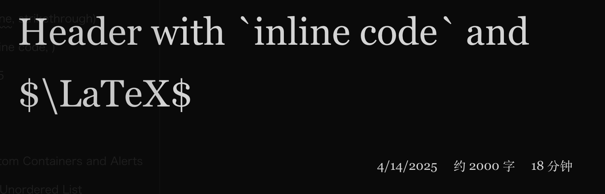

从零开始搭建博客网站（九）：文章的更多信息。

---

[[toc]]

## 文章的信息

我们在 [之前的文章](build_a_blog_site_6.md#改一点结构) 中为文件文章页面添加了标题。对于一个成熟的博客网站而言，我们需要更多的信息，比如创建时间、最后修改时间、分类、标签等。

### VitePress 提供的

想一下我们 [之前](build_a_blog_site_5.md#构建时数据加载-build-time-data-loading) 做的 `posts.data.ts` 文件，里面使用 `createContentLoader` 来加载文章的数据。这里加载的数据是一个类型为 `ContentData[]` 的数组，默认可访问的数据包括文章的 `url` 和 `frontmatter`，并且提供了 `src`、`html` 和 `excerpt` 等可供选择的数据，分别可以在配置 `includeSrc`、`render` 和 `excerpt` 为 `true` 时访问。这里我们需要用到 `src` 和 `excerpt`。

```ts {15-19}
// ...

export interface Data {
  url: string;
  frontmatter: Record<string, any>;
  excerpt?: string; // [!code ++]
}

// ...

export default createContentLoader("posts/*.md", {
  includeSrc: true, // [!code ++:2]
  excerpt: true,
  transform(raw) {
    return raw.map(({ url, frontmatter, excerpt }) => ({
      url,
      frontmatter,
      excerpt,
    }));
  },
});
```

### 在 frontmatter 中添加

当然我们也可以自由地在文章的 frontmatter 中添加我们需要的信息，比如创建时间、最后修改时间、分类、标签等。

```md
---
title: 'Header with `inline code` and $\LaTeX$'
created: 2025-04-14  <!-- [!code ++:7] -->
last_modified: 2025-04-14
category: 共读
tags:
  - 标签1
  - 标签2
  - 标签3
---

<!-- ... -->
```

### 处理

对于 `created` 和 `last_modified`，我们可以在 `posts.data.ts` 中添加对其显示格式的处理。

```ts
// ...

function formatDate(raw: string): { raw: Date; formattedString: string } {
  const date = new Date(raw);
  return {
    raw: date,
    formattedString: date.toLocaleDateString("en-US", {
      year: "numeric",
      month: "numeric",
      day: "numeric",
    }),
  };
}

// ...
```

我们可用用 `src` 来估算阅读时间：

````ts
function calculateReadingTime(text?: string): ReadingTimeInfo {
  if (!text) {
    return { minutes: 0, words: 0 };
  }

  const WORDS_PER_MINUTE_ZH = 400;
  const WORDS_PER_MINUTE_EN = 225;
  const BLOCKS_PER_MINUTE_CODE = 1;

  const content = text
    .replace(/---[\s\S]*?---/, "") // Remove frontmatter
    .replace(/<[\s\S]*?>/g, ""); // Remove HTML tags

  const countZh = content.match(/[\u4E00-\u9FA5]/g)?.length || 0;
  const countEn = content.match(/[a-z]/gi)?.length || 0;
  const countCodeBlocks = content.match(/```[\s\S]*?```/g)?.length || 0;

  const minutes = Math.ceil(countZh / WORDS_PER_MINUTE_ZH + countEn / WORDS_PER_MINUTE_EN + countCodeBlocks * BLOCKS_PER_MINUTE_CODE);

  const words = Math.ceil((countZh + countEn) / 100) * 100;

  return {
    minutes,
    words,
  };
}
````

这里我们对阅读速度进行了简单的假设，并对中文、英文和代码块分别进行了处理。

最后，将以上结合起来，再把类型检查做好：

````ts twoslash
import { createContentLoader } from "vitepress";

interface FormattedDate {
  raw: Date;
  formattedString: string;
}

interface ReadingTimeInfo {
  minutes: number;
  words: number;
}

export interface Data {
  url: string;
  frontmatter: Record<string, any>;
  excerpt?: string;
  created: FormattedDate;
  lastModified: FormattedDate;
  readingInfo: ReadingTimeInfo;
}

declare const data: Data[];
export { data };

function formatDate(raw: string): FormattedDate {
  const date = new Date(raw);
  return {
    raw: date,
    formattedString: date.toLocaleDateString("en-US", {
      year: "numeric",
      month: "numeric",
      day: "numeric",
    }),
  };
}

function calculateReadingTime(text?: string): ReadingTimeInfo {
  if (!text) {
    return { minutes: 0, words: 0 };
  }

  const WORDS_PER_MINUTE_ZH = 400;
  const WORDS_PER_MINUTE_EN = 225;
  const BLOCKS_PER_MINUTE_CODE = 1;

  const content = text
    .replace(/---[\s\S]*?---/, "") // Remove frontmatter
    .replace(/<[\s\S]*?>/g, ""); // Remove HTML tags

  const countZh = content.match(/[\u4E00-\u9FA5]/g)?.length || 0;
  const countEn = content.match(/[a-z]/gi)?.length || 0;
  const countCodeBlocks = content.match(/```[\s\S]*?```/g)?.length || 0;

  const minutes = Math.ceil(countZh / WORDS_PER_MINUTE_ZH + countEn / WORDS_PER_MINUTE_EN + countCodeBlocks * BLOCKS_PER_MINUTE_CODE);

  const words = Math.ceil((countZh + countEn) / 100) * 100;

  return {
    minutes,
    words,
  };
}

export default createContentLoader("posts/*.md", {
  includeSrc: true,
  excerpt: true,
  transform(raw) {
    return raw.map(({ url, frontmatter, excerpt, src }) => ({
      url,
      frontmatter,
      excerpt,
      created: formatDate(frontmatter.created),
      lastModified: formatDate(frontmatter.last_modified),
      readingInfo: calculateReadingTime(src),
    }));
  },
});
````

### 在页面中使用

在 `PageContentPost.vue` 中，我们可以导入 `posts.data.ts` 中的数据。由于 `posts.data.ts` 中的数据是所有文件的数据数组，我们需要通过某种方式来筛选出当前页面对应的数据，这里我们通过标题来筛选，因为它可以同时在 `useData` 返回的 `frontmatter` 和 `posts.data.ts` 中的数据中获取。

```vue
<script setup lang="ts">
import { useData } from "vitepress";
import { data as posts } from "../src/posts.data"; // [!code ++]

const { frontmatter } = useData();

const post = posts.filter((post) => post.frontmatter.title === frontmatter.value.title)[0]; // [!code ++]

const metaStrings = [
  // [!code ++:5]
  post.created.formattedString,
  `约 ${post.readingInfo.words} 字`,
  `${post.readingInfo.minutes} 分钟`,
];
</script>

<!-- ... -->
```

然后在模板中使用。

```vue
<template>
  <!-- ... -->
  <!-- [!code ++:15] -->
  <div
    un-mb-5
    un-page-content
    un-flex
    un-gap-5
    un-justify-end
    un-font-serif
  >
    <div
      v-for="metaString in metaStrings"
      :key="metaString"
    >
      {{ metaString }}
    </div>
  </div>
  <!-- ... -->
</template>
```



在 `PageContentHome.vue` 的目录里，也可以将这些数据用上。这里我们可以根据 `frontmatter` 中的 `category` 来做一个简单的分类：

```vue

```
