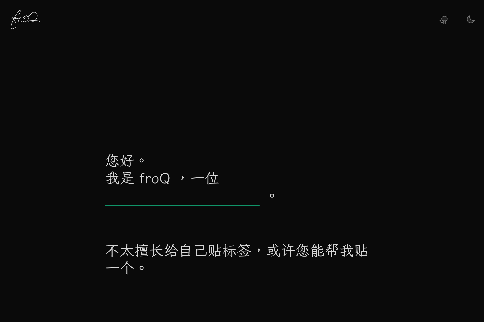

优化一个博客网站（一）：好看点。

---

[[toc]]

## 承上

迄今为止，
我们已经完成了一个博客网站的基本搭建。
具体而言，我们有了一个根据文章 `category` 进行分类的简单目录，
完成了基本可读的文章样式，
设计了 404 和 contact 页面的简单样式。

从现在开始，我将把这个博客网站作为自己的主站点，
根据自己的需求，
将优化与美化的过程进行简单的记录。

你可以理解为这是一个新坑。

虽然这个新坑不会像上一个坑一样事无巨细，
但你仍然可以学习到很多东西。

## 好看点

### 主页

沿袭一下之前扉页的设计：

这里的实现都很简单，就不多说了。

左上角的 logo 是一个带动画的 svg，
这个想法来自 [Anthony Fu](https://antfu.me/) 的博客
[Animated SVG Logo](https://antfu.me/posts/animated-svg-logo)。

<SvgFroqLogo :animated="true" un-w-full un-h-50 un-m-2/>
