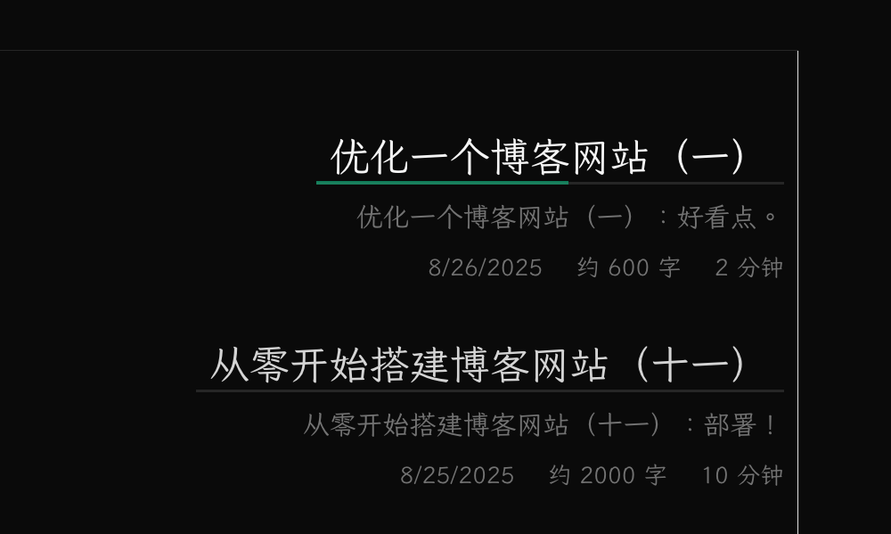
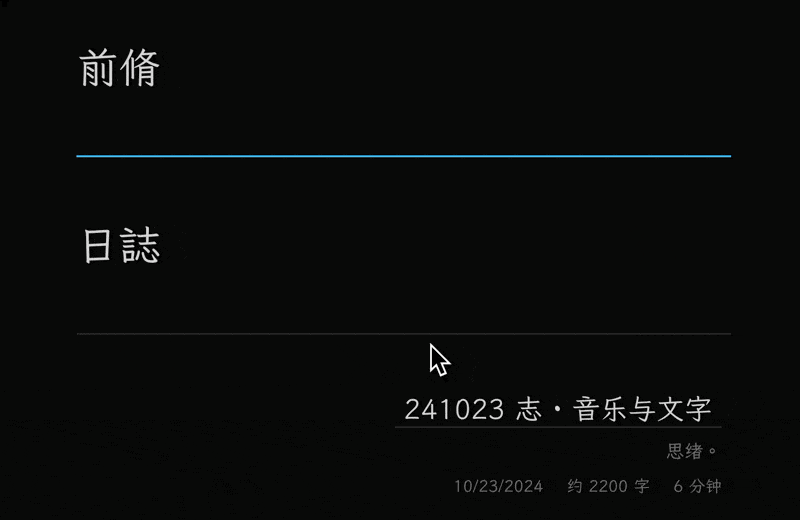
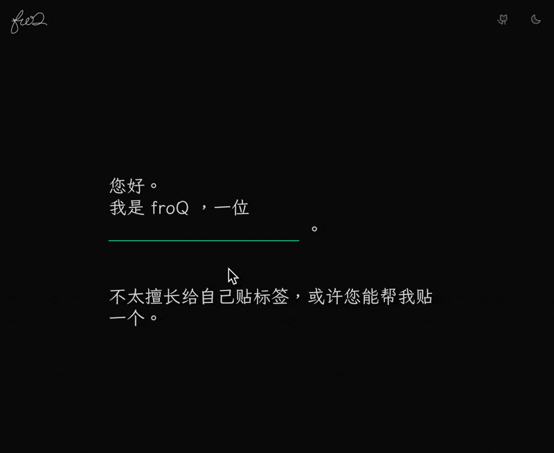

优化一个博客网站（一）：好看点。

---

[[toc]]

<script setup lang="ts">
import SvgFroqLogo from '@theme/components/SvgFroqLogo.vue'
</script>

## 承上

迄今为止，
我们已经完成了一个博客网站的基本搭建。
具体而言，我们有了一个根据文章 `category` 进行分类的简单目录，
完成了基本可读的文章样式，
设计了 404 和 contact 页面的简单样式。

从现在开始，我将把这个博客网站作为自己的主站点，
根据自己的需求，
将优化与美化的过程进行简单的记录。

你可以理解为这是一个新坑。

虽然这个新坑不会像上一个坑一样事无巨细，
但你仍然可以学习到很多东西。

## 好看点

### 主页

沿袭一下之前扉页的设计：


这里的实现都很简单，就不多说了。

左上角的 logo 是一个带动画的 svg，
这个想法来自 [Anthony Fu](https://antfu.me/) 的博客
[Animated SVG Logo](https://antfu.me/posts/animated-svg-logo)。

<SvgFroqLogo :animated="true" un-w-full un-h-50 un-m-2/>

### 目录

#### 链接

这里用到的是一个比较常规的设计。


你可以在很多地方发现相似的设计，
比如 [@Innie](https://innei.in/) 里面的链接。

各分类下的文章列表也采用了相似（或许是相同）的设计：



这个样式我们后续还会用到，所以把它单独抽出来做成一个组件：

```vue
<script setup lang="ts">
defineProps<{
  href: string
  text: string
}>()
</script>

<template>
  <div
    un-max-w-full
    un-inline-block
    un-duration-400
    un-relative
    un-px-2
    un-after="content-empty bg-neutral-200 dark:bg-neutral-800 w-full h-2px absolute bottom-0 left-0 z-0"
    un-before-w-0
    un-before-h-3px
    un-before-left-0
    un-before-bottom-0
    un-before-z-1
    un-before-rounded-none
    un-before-absolute
    un-hover-before-w-full
    un-before-transition-width
    un-before-content-empty
  >
    <a
      un-inline-block
      :href="href"
    >
      {{ text }}
    </a>
  </div>
</template>
```

随后，可以在 `PageContentHome.vue` 中使用它：

```vue {14-16}
<template>
  <un-page-contetnt un-min-h-100vh>
    <!-- ... -->
    <div
      v-for="category in categories"
      :key="category"
      un-ml="[25%]"
      un-even="pl-10"
      un-my-10
    >
      <LinkUnderline
        :href="`#${category}`"
        :text="category"
        un-text="neutral-700 dark:neutral-300 hover:neutral-950 dark:hover:neutral-50 2xl"
        un-before="bg-rose-600 dark:bg-rose-400"
        un-italic
      />
    </div>
    <!-- ... -->
  </un-page-contetnt>
</template>
```

这里使用了
[fallthrough attributes](https://vuejs.org/guide/components/attrs.html)
来控制 `LinkUnderline` 中根元素的文字和下划线的样式。

## 好用点

### 进度条

对于每个 category，做了一个进度条：



讲一下具体实现。
首先，两个 `div` 分别作为进度条的前景和背景,
背景的宽度是 `100%`，
而前景的宽度通过一个内联的 `--progress-bar-width` 变量控制，
则我们只需要在 `window` 的滚动事件中更新这个变量就好了。

```vue
<script setup lang="ts">
import { onMounted } from 'vue'
// ...
onMounted(() => {
  const handleScroll = (el: HTMLElement) => {
    const categoryWrapper = el.parentElement
    if (categoryWrapper) {
      const scrollY = window.scrollY
      const wrapperOffsetY = categoryWrapper.offsetTop
      const wrapperWidth = categoryWrapper.offsetWidth
      const windowHeight = window.innerHeight

      // if the height of the category wrapper is less than the height of the window,
      // then the progress bar should be 100%
      if (categoryWrapper.offsetHeight <= windowHeight) {
        el.style.setProperty('--progress-bar-width', `${wrapperWidth}px`)
        return
      }

      const percentage = Math.min(1, Math.max(0, (scrollY - wrapperOffsetY) / Math.max(0, categoryWrapper.offsetHeight - windowHeight)))
      el.style.setProperty('--progress-bar-width', `${percentage * wrapperWidth}px`)
    }
  }

  const observer = new IntersectionObserver((entries) => {
    entries.forEach((entry) => {
      const el = entry.target as HTMLElement
      if (entry.isIntersecting) {
        // add scroll event listener when the element enters the viewport
        document.addEventListener('scroll', () => handleScroll(el))
      }
      else {
        // remove scroll event listener when the element leaves the viewport
        document.removeEventListener('scroll', () => handleScroll(el))
      }
    })
  }, { threshold: 0 }) // trigger when the element enters the viewport

  document.querySelectorAll<HTMLElement>('.title-wrapper').forEach((el: HTMLElement) => {
    observer.observe(el)
  })
})
</script>
```

乍一看这一坨代码，有点超雄了。
其实就是做了一个条件渲染，
仅当 `categoryWrapper` 可见时，才添加滚动事件。
简单的性能优化。

### 固定 Logo

把 logo 从 `PageContentNav.vue` 中拆出来，
放在 `Layout.vue` 中,
让它固定在顶部，
方便点击回到主页。



### 摘要可见性

乍一看有点密密麻麻的，
可读性略差。
可以在每个 category 下加一个切换摘要可见性的 checkbox。
