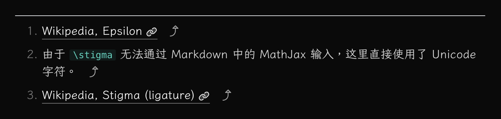

优化一个博客网站（二）：文章页面的其他玩意。

---

[[toc]]

## 统一口径

先把头部的日期统一掉。

## 上/下一篇文章

最简单的方式是把上一篇和下一篇日期最近的文章放出来，
但对于我这个博客来说，因为有「共讀」这个类别，
前后两篇文章可能属于共读里面的不同「系列」，
所以这里更合理的做法是在文章的 frontmatter
中加入可选的属性来记录这篇文章所属的系列，
并优先通过这个属性来确定同系列的上一篇和下一篇文章。
这里我用了 `series` 这个属性来做。

## 页脚

简单地在页脚加上署名：

## 回到顶部 / 去到底部

也是很简单的东西，不过多解释：

这里可以做的处理是，
检测当前滚动高度，如果已经在顶部或底部，
则不显示相应的按钮。

## 一些渲染问题

VitePress 通过 markdown-it 渲染 markdown 文件，
在其提供的 `<Content />` 组件中，
所有内容都是已经渲染好的 HTML。
不过，由于在主页里，我们会显示文章的标题和摘要,
而这部分内容中是可能包含 markdown 语法的，
它们并不会被渲染。

这里的处理方式是通过 markdown-it 手动渲染这部分内容,
并通过 `v-html` 将渲染好的 HTML 显示在页面上。 #ok #shit

## 一些 markdown 样式的改进

### 脚注

简单做一下脚注，主要是小字体和 backref icon。

