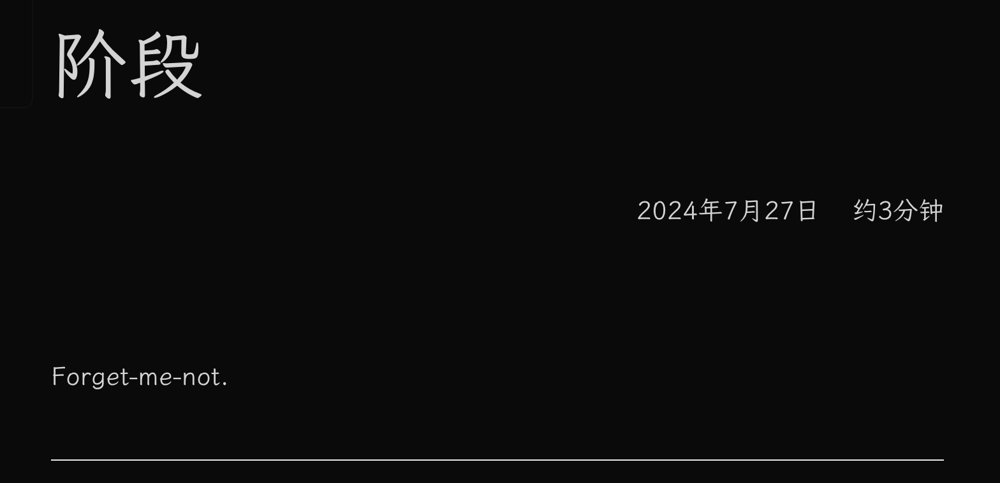

优化一个博客网站（二）：文章页面的其他玩意。

---

[[toc]]

## 统一口径

先把头部的日期统一掉。

## 上/下一篇文章

最简单的方式是把上一篇和下一篇日期最近的文章放出来，
但对于我这个博客来说，因为有「共讀」这个类别，
前后两篇文章可能属于共读里面的不同「系列」，
所以这里更合理的做法是在文章的 frontmatter
中加入可选的属性来记录这篇文章所属的系列，
并优先通过这个属性来确定同系列的上一篇和下一篇文章。
这里我用了 `series` 这个属性来做。
