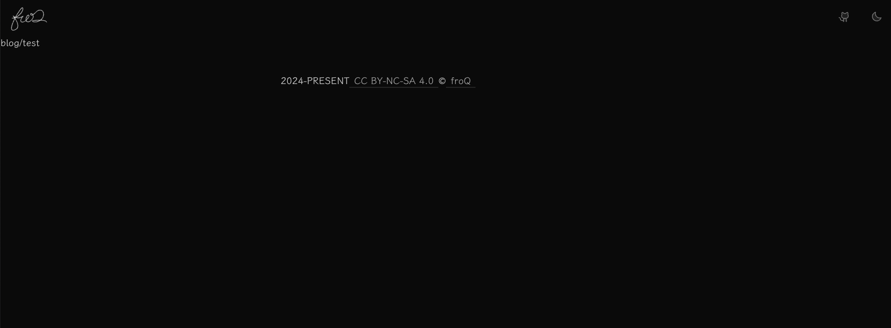

优化一个博客网站（三）：按标签分类。

---

[[toc]]

## 按标签分类

### 改点东西

之前加过一个 `markdown-it-hashtag` 的插件，
不过它默认把所有的 `#` 和标签文本放在一起，
这样一来，除了使用 JS，
没有比较好的方式来隐藏这个 `#`。

看看 `markdown-it-hashtag` 的 [repo](https://github.com/svbergerem/markdown-it-hashtag)，里面讲了怎么去配置标签的文本以及生成的 HTML tag 的结构。

还有一个问题是，它默认的 regex 是 `\\w+`，
这意味着它只能处理一个层级的标签。

所以进行了下面的配置：

```ts {10-12}
import { defineConfig } from 'vitepress'
// ...

export default defineConfig({
  // ...
  markdown: {
    config: (md) => {
      md
        .use(markdownItHashtag, {
          hashtagRegExp: '\\w+(\\/\\w+)*',
        })
      // ...

      md.renderer.rules.hashtag_text = function (tokens, idx) {
        return `${tokens[idx].content}`
      }

      md.renderer.rules.hashtag_open = function (tokens, idx) {
        const tagName = tokens[idx].content.toLowerCase()
        return `<a href="/tags/${tagName}"><span class="tag">`
      }

      md.renderer.rules.hashtag_close = function () {
        return `</span></a>`
      }
    }
  }
})
```

好了，现在点击一个标签，比如 #blog/test ,
就会跳转到 `/tags/blog/test`。

然后你就会发现你其实去了 `404`。

### 标签页面

所以，现在我们需要一个标签页面，
来显示这个标签下的所有文章。
这里我们用到 VitePress 的 [动态路由](https://vitepress.dev/guide/routing#dynamic-routes)
来实现。

首先，在 `docs/` 目录下新建一个 `tags` 文件夹,
然后在里面新建一个 `[tag].md` 和 `[tag].paths.ts` 文件。
我们将在这个 `[tag].paths.ts` 文件中配置所有 `/tags/[tag]` 的路由，
其中 `[tag]` 就是动态路由的参数，我们可以用它来筛选文章。

所以我们怎么提取到各篇文章中所有的标签呢？
我们之前在[生成文章列表](build_a_blog_site_5.md)时，
使用构建时数据加载来对每一篇文章进行处理。
同理，我们可以在这个过程中提取到文章中的所有标签。

在 `posts.data.ts` 文件中，我们可以用正则来做：

```ts twoslash {7,13-21,23-45,49,53}
import { createContentLoader } from 'vitepress'

// ...

export interface Data {
  // ...
  tags: string[]
}

declare const data: Data[]
export { data }

function dealTagHierarchy(tag: string): string[] {
  const tags = new Set<string>()
  const levels = tag.split('/')
  levels.forEach((_: string, i: number) => {
    tags.add(levels.slice(0, i + 1).join('/'))
  })

  return Array.from(tags)
}

function getTags(html: string | undefined, frontmatter: Record<string, any>): string[] {
  if (!html) {
    return []
  }

  const tags: Set<string> = new Set()
  const tagReg = /<a href="\/tags\/[^"]*">\s*<span class="tag">(.*?)<\/span>\s*<\/a>/g
  let match: RegExpExecArray | null = tagReg.exec(html)

  while (match) {
    tags.add(match[1])
    dealTagHierarchy(match[1]).forEach(tag => tags.add(tag))
    match = tagReg.exec(html)
  }

  if (frontmatter.tags) {
    for (const tag of frontmatter.tags) {
      dealTagHierarchy(tag).forEach(tag => tags.add(tag))
    }
  }

  return Array.from(tags)
}

export default createContentLoader('posts/**/*.md', {
  // ...
  render: true,
  transform(raw) {
    return raw.map(({ html, url, frontmatter, excerpt, src }) => ({
      // ...
      tags: getTags(html, frontmatter),
    }))
      .sort((a, b) => b.created.raw.getTime() - a.created.raw.getTime())
  },
})
```

讲一下。
首先，这里其实可以用 `src` 去匹配，它内容更少，理论上更快，
但是我试了一下，会匹配到代码块、行内代码以及链接的锚点中的 `#`，
我没有深入研究正则，所以这里直接用了比较 hacky 的方式。

其次，我们需要考虑标签的层级,
即对于 `#a/b/c` 这样的标签，需要提取出 `#a`, `#a/b`, `#a/b/c` 这三个标签。
所以在这里，
我们定义了 `dealTagHierarchy()` 函数来处理标签的层级。

最后，我们可能会在文章的 frontmatter 中定义标签,
这里用了相同的逻辑处理，然后加入到 `tags` 中。

现在，我们可以在 `[tag].paths.ts` 文件中配置路由了：

```ts
import posts from '../.vitepress/theme/src/posts.data'

export default {
  async paths() {
    const loadedPosts = await posts.load()

    return loadedPosts
      .map(post => post.tags)
      .flat()
      .map((tag) => {
        return { params: { tag } }
      })
  },
}
```

现在再点开刚刚的链接，
一片黑，但至少不是 404。

### 页面渲染

一片黑很好理解，
毕竟我们的 `[tag].md` 文件是空的。
但看到控制台有报错，是由 `PageContentPost.vue` 抛出的。
懂得人已经懂了，我们在 `PageContent.vue` 中的 DOM 是这样的：

```vue
<script setup lang="ts">
import { useData, useRoute } from 'vitepress'
import PageContentHome from './PageContentHome.vue'
import PageContentNotFound from './PageContentNotFound.vue'
import PageContentPost from './PageContentPost.vue'

const { page, frontmatter } = useData()
</script>

<template>
  <PageContentHome v-if="frontmatter.home" />
  <PageContentNotFound v-else-if="page.isNotFound" />
  <PageContentPost
    v-else
    :key="page.filePath"
  />
</template>
```

也就是说，只要不是主页，
我们就会去渲染 `PageContentPost.vue`。
我们可以在 `PageContentPost.vue` 中添加额外的逻辑去渲染标签的页面，
但当然我们也可以新开一个组件，
毕竟你都叫 `...Post` 了，那我还说啥呢兄弟？

新做一个 `PageContentTags.vue`，然后在 `PageContent.vue` 中条件渲染。

```vue {15-25}
<script setup lang="ts">
import { useData, useRoute } from 'vitepress'
import PageContentHome from './PageContentHome.vue'
import PageContentNotFound from './PageContentNotFound.vue'
import PageContentPost from './PageContentPost.vue'
import PageContentTag from './PageContentTag.vue'

const { page, frontmatter } = useData()
const { path } = useRoute()
</script>

<template>
  <PageContentHome v-if="frontmatter.home" />
  <PageContentNotFound v-else-if="page.isNotFound" />
  <div
    v-else
    :key="path"
  >
    <PageContentTag
      v-if="frontmatter.tag"
    />
    <PageContentPost
      v-else
    />
  </div>
</template>
```

这里把他们放在同一个 `<div>` 中是为了可以用 `path` 作为 `key`
去控制[组件更新](https://vuejs.org/api/built-in-special-attributes.html#key)。

简单先写一下 `PageContentTag.vue`:

```vue
<script setup lang="ts">
import { useData } from 'vitepress'

const { params } = useData()
</script>

<template>
  <div>
    {{ params!.tag }}
  </div>
</template>
```

现在再点进去看看呢：



看到了当前动态路由的 `tag` 参数了。那现在就可以根据这个参数来筛选文章了。

### 文章筛选

也就是说现在来做一下 `PageContentTag.vue` 中的逻辑。

先明确一下，对于一个标签，我们应该在页面上显示属于这个标签以及其子标签的文章。
比如对于标签 `blog`，我们不仅要显示标签为 `blog` 的文章,
同时还要显示标签为 `blog/test` 的文章。
